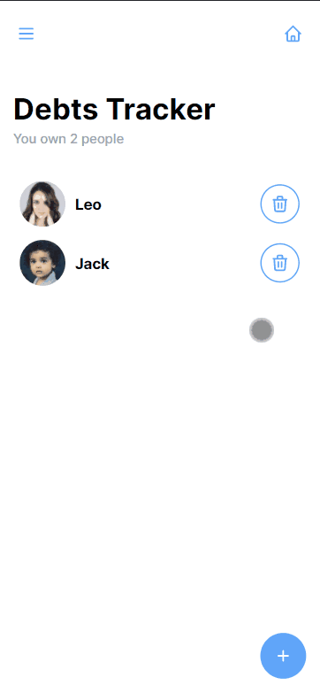

# Debt Tracker With VueJS

Track people who you lend Money to !

## Table of contents

- [Overview](#overview)
  - [Screenshot](#screenshot)
  - [Links](#links)
- [My process](#my-process)
  - [Built with](#built-with)
  - [Useful resources](#useful-resources)
- [Author](#author)

## Overview

### Screenshot

### Links

- Live Site URL: [visite site]()

### Built with

- [VueJS](https://vuejs.org/) - JS library
- [VueJS](https://vuex.vuejs.org/) - State Management
- [Tailwindcss](https://tailwindcss.com/) - Css library

### Useful resources

- [Tailwindcss Docs](https://tailwindcss.com/docs/installation) - This helped me for the utility classes

## Author

- Github - [Akram Chawki](https://github.com/AkramChawki/)